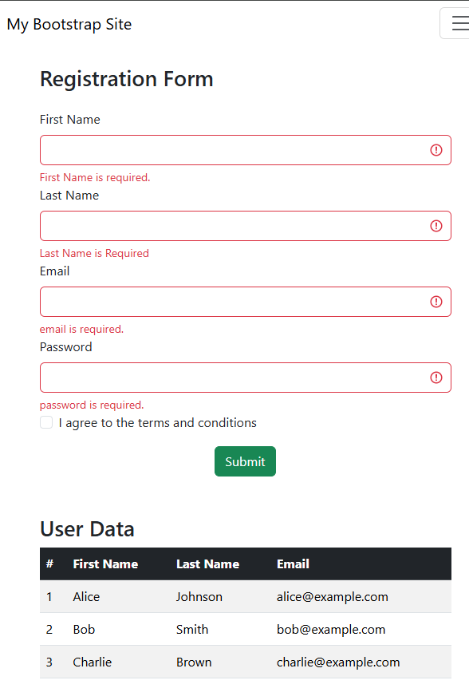

# Bootstrap Registration & Layout Project

## 📌 Table of Contents
- [Introduction](#introduction)
- [Features](#features)
- [Technologies Used](#technologies-used)
- [Installation](#installation)
- [Usage](#usage)
- [Project Structure](#project-structure)
- [Screenshots](#screenshots)
- [Author](#author)

---

## 📝 Introduction
This project demonstrates how to build a responsive web layout using Bootstrap.  
It includes a registration form with validation, a light styled navbar, responsive images, buttons with visibility utilities, and a user data table.

---

## ✨ Features
- **Responsive Navbar**
  - Links to Home, About, and Contact.
  - Collapses into a hamburger menu on smaller screens.
  - Light style
- **Registration Form**
  - First, last Name, Email, and Password fields positioned side by side with Bootstrap validation classes.
  - Fields stack on smaller screens.
  - Checkbox for agreeing to terms and conditions.
  - Submit button styled with `btn-success`.
- **User Data Table**
  - Responsive table with striped and hoverable rows.
  - Pre-filled with hard-coded user data.
- **Responsive Images**
  - Full-width banner image (`img-fluid` inside `container-fluid`).
  - Circular profile image (`rounded-circle`).
  - Responsive to page resizing.
- **Responsive Buttons**
  - One always visible.
  - Second hidden on small screens (`d-none d-md-inline-block`).
  - Both styled as input

---

## 🛠 Technologies Used
- [Bootstrap 5](https://getbootstrap.com/)
- HTML5
- CSS3 (via Bootstrap utilities)

---

## ⚙️ Installation
1. Clone the repository:
   ```bash
   git clone https://github.com/your-username/bootstrap-layout-project.git

Usage
- Navigate through the navbar to access Home, About, and Contact.
- Fill out the registration form (required fields: Email, Password).
- View user data in the responsive table.
- Resize the browser to see responsive behavior of images, navbar, and buttons.

📂 Project Structure
bootstrap-layout-project/
│── index.html       # Main HTML file
│── README.md        # Documentation
│── assets/          

📸 Screenshots



👩‍💻 Author

Your Name

GitHub: @kwinsacowski

LinkedIn: https://www.linkedin.com/in/kayla-salmon-1b8632378/